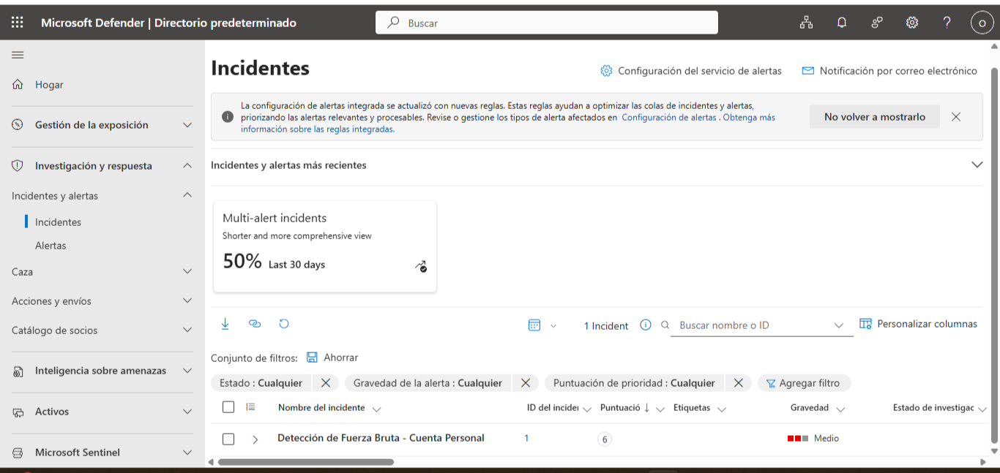

# Incident Management in Microsoft Defender
Reviewing and managing security incidents within the Microsoft Defender portal. This view shows a "Brute Force Attack" detection, where multiple alerts are correlated into a single incident for prioritized investigation and response.

### Key Actions:
* **Incident Correlation:** Grouping related alerts to reduce fatigue.
* **Severity Assessment:** Categorizing the incident as 'Medium' based on threat impact.
* **Status Tracking:** Moving the incident through the lifecycle (New -> In Progress -> Resolved).

